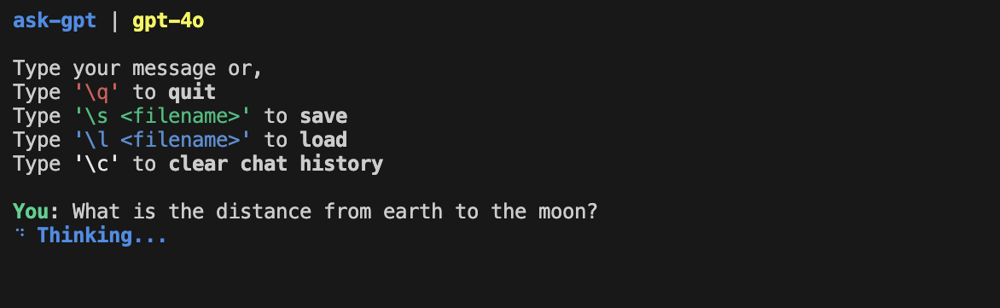

# simply ask GPT

A lightweight Python CLI to chat with OpenAI's GPT models.



## Setup
Clone the repo and install [Poetry](https://python-poetry.org/docs/#installation)  

Install dependencies:
```
poetry install
```

Copy the example environment file and add your OpenAI API key
```
cp .env.example .env
```

To start chatting
```
poetry run ask-gpt
```

To quit the chat
```
\q
```

To save current chat to a JSON file
```
\s <filename>
```

To load a previous chat session from a file
```
\l <filename>
```

To clear chat history and start again
```
\c
```

## Features
- Chat directly with OpenAI models
- Maintain conversation history
- Save, load and clear chat sessions
- Choose different models (coming soon)